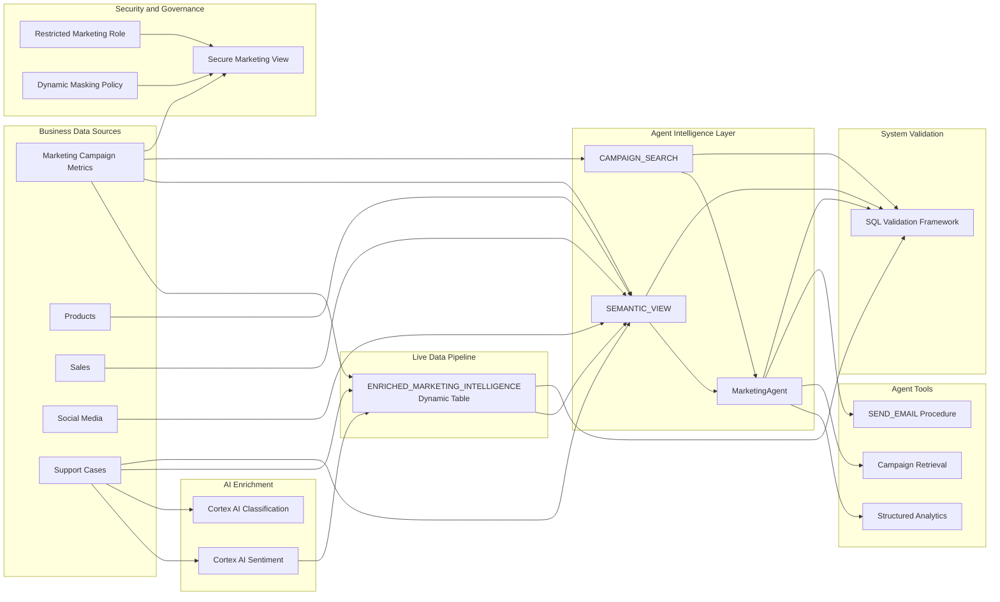

# End-to-End Snowflake AI Agent Pipeline

<p align="center">
  
  
  
  
  
  
</p>

<p align="center">
  <strong>A governed Snowflake data and AI architecture that converts marketing performance, sales activity and customer feedback into an agent-ready intelligence layer.</strong>
</p>

---

## Project Overview

This project implements an end-to-end Snowflake AI workflow that brings together structured business data and unstructured customer-support feedback.

The solution enriches support transcripts with Cortex AI, maintains the enriched results through a Snowflake Dynamic Table, models the data through a Semantic View, enables retrieval through Cortex Search and exposes the complete system through a Marketing and Sales Intelligence Agent.

The Agent can answer analytical questions, explain customer sentiment, retrieve campaign information, generate visual outputs and send results through a Snowflake stored procedure.

I also completed the optional governance implementation by creating a restricted role, a secure view and a Dynamic Data Masking policy. The security controls were verified by showing real engagement values to an administrator and masked values to the restricted marketing role.

> [!IMPORTANT]
> The completed implementation passed the supplied Snowflake validation framework and returned:
>
> **You've successfully completed the From Zero to Agents lab!**

---

## Recruiter Snapshot

| Area | Implementation |
|---|---|
| Cloud data platform | Snowflake |
| AI enrichment | Cortex AI sentiment analysis and classification |
| Pipeline automation | Snowflake Dynamic Tables |
| Structured analytics | Snowflake Semantic View |
| Retrieval | Cortex Search |
| AI application | Marketing and Sales Intelligence Agent |
| Agent tools | Semantic analysis, search and email delivery |
| Governance | RBAC, secure views and Dynamic Data Masking |
| Validation | SQL control framework verifying infrastructure and AI objects |
| Languages and formats | SQL, Markdown and CSV |

---

## Business Problem

Marketing teams often analyse campaign performance separately from customer feedback.

That creates an incomplete view:

- Campaign metrics explain **what happened**.
- Sales data shows **what customers purchased**.
- Support transcripts reveal **why customers were satisfied or dissatisfied**.
- Social-media activity indicates **how products were discussed externally**.

This project brings those signals into one governed Snowflake environment so an AI Agent can connect operational performance with customer experience.

The result is an intelligence layer capable of answering questions such as:

- Which campaigns generated the most engagement?
- How is campaign activity related to product performance?
- Which categories receive the most negative customer feedback?
- What are the main complaints found in support cases?
- Can the findings be presented visually or sent by email?

---

## Architecture



---

## End-to-End Flow

```text
Marketing, product, sales, social-media and support data
                         ↓
        Cortex AI sentiment and classification
                         ↓
      Live ENRICHED_MARKETING_INTELLIGENCE table
                         ↓
          Semantic View + Cortex Search service
                         ↓
          Marketing and Sales Intelligence Agent
                         ↓
      Analytics, retrieval, charts and email delivery
                         ↓
       RBAC, secure views and data masking controls
                         ↓
             Automated SQL validation
```

---

# Implementation

## 1. Environment Provisioning

The setup script creates the Snowflake environment used throughout the project.

### Main environment

```text
Role:      SNOWFLAKE_INTELLIGENCE_ADMIN
Warehouse: DASH_WH_SI
Database:  DASH_DB_SI
Schema:    RETAIL
```

### Source tables

```text
MARKETING_CAMPAIGN_METRICS
PRODUCTS
SALES
SOCIAL_MEDIA
SUPPORT_CASES
```

### Additional objects

The environment also provisions supporting resources such as:

- Snowflake stages
- Notification integration
- Email-delivery stored procedure
- Roles and access grants
- Validation utilities

### Setup file

```text
sql/00_setup/00_setup.sql
```

---

## 2. Cortex AI Enrichment

Customer-support transcripts begin as unstructured text.

The enrichment layer converts those transcripts into features that can be queried and analysed using SQL.

### Enrichment functions

```sql
SNOWFLAKE.CORTEX.AI_SENTIMENT(transcript)
```

Generates a sentiment score representing the emotional direction of a customer interaction.

```sql
SNOWFLAKE.CORTEX.AI_CLASSIFY(
    transcript,
    ['Return', 'Quality', 'Shipping']
)
```

Classifies each transcript into a defined support category.

### Why enrich before agent execution?

Precomputing the features improves the architecture in several ways:

- The Agent does not need to reinterpret every transcript for every question.
- Sentiment becomes available as a measurable analytical value.
- Issue categories become reusable across queries and dashboards.
- Transformation logic remains visible and testable in SQL.
- Downstream tools operate on a more consistent data contract.

### Enrichment file

```text
sql/01_enrichment/01_cortex_ai_enrichment.sql
```


---

## 3. Live Dynamic Table Pipeline

The project creates the following Dynamic Table:

```text
DASH_DB_SI.RETAIL.ENRICHED_MARKETING_INTELLIGENCE
```

It joins campaign performance with product-level customer feedback and maintains the enriched result as source data changes.

### Pipeline logic

```sql
CREATE OR REPLACE DYNAMIC TABLE enriched_marketing_intelligence
TARGET_LAG = '1 hours'
WAREHOUSE = dash_wh_si
AS
SELECT
    m.campaign_name,
    m.clicks,
    s.product AS product_name,
    SNOWFLAKE.CORTEX.SENTIMENT(s.transcript) AS avg_sentiment
FROM marketing_campaign_metrics m
JOIN support_cases s
    ON m.category = s.product;
```

### Why a Dynamic Table?

A Dynamic Table allows the desired transformation output to be defined declaratively while Snowflake manages refresh behaviour.

This separates the analytical model from manual refresh orchestration and creates a maintained bridge between marketing data and customer sentiment.

### Pipeline file

```text
sql/02_pipeline/02_live_enrichment_pipeline.sql
```


---

## 4. Semantic View

The Semantic View provides a business-friendly analytical layer over the project data.

### Configuration

```text
Name:      SEMANTIC_VIEW
Location:  DASH_DB_SI.RETAIL
Warehouse: DASH_WH_SI
```

It contains:

- Marketing campaign metrics
- Products
- Sales
- Social-media activity
- Support cases
- Enriched campaign and sentiment data

### Modelled relationship

```text
ENRICHED_MARKETING_INTELLIGENCE.PRODUCT_NAME
                         ↓
MARKETING_CAMPAIGN_METRICS.CATEGORY
```

Relationship type:

```text
Many to One
```

### Why the Semantic View matters

The Semantic View gives business meaning to the physical data model. It allows the Agent to reason over measures, dimensions and relationships rather than depending entirely on raw table names.

### Configuration documentation

```text
agent/01_semantic_view_configuration.md
```


---

## 5. Cortex Search

The project creates a Cortex Search service named:

```text
DASH_DB_SI.RETAIL.CAMPAIGN_SEARCH
```

### Search configuration

```text
Source table:  MARKETING_CAMPAIGN_METRICS
Search column: CAMPAIGN_NAME
Attributes:    All
Columns:       All
Warehouse:     DASH_WH_SI
```

Cortex Search gives the Agent a retrieval tool for campaign-level information.

This complements the Semantic View:

- The Semantic View handles structured analytical questions.
- Cortex Search handles retrieval-oriented requests.
- The Agent chooses the appropriate tool based on the user’s question.

### Configuration documentation

```text
agent/02_cortex_search_configuration.md
```


---

## 6. Marketing and Sales Intelligence Agent

The central application object is:

```text
DASH_DB_SI.RETAIL.MarketingAgent
```

The Agent was designed to bridge two forms of intelligence:

```text
What happened?
→ Campaign, sales and engagement metrics

Why did it happen?
→ Customer sentiment and support feedback
```

### Agent capabilities

The Agent can:

- Rank campaigns by engagement
- Analyse campaign and product relationships
- Compare campaign clicks with customer satisfaction
- Summarise customer complaints
- Generate charts
- Retrieve indexed campaign information
- Send generated findings through email

### Agent tools

| Tool | Purpose |
|---|---|
| `semantic_view` | Structured analysis across campaign, product, sales, social-media, support and sentiment data |
| `Search` | Retrieval through the `CAMPAIGN_SEARCH` Cortex Search service |
| `Send_Email` | Delivery of Agent findings using the `SEND_EMAIL()` procedure |

### Agent configuration

```text
agent/03_marketing_agent_configuration.md
```

### Validation prompts

```text
agent/04_agent_validation_prompts.md
```

---

## 7. Agent Validation

The Agent was tested using business-focused questions rather than only technical queries.

### Question 1

```text
What are the top 5 campaigns by clicks?
```

Tests ranking and structured campaign analysis.

### Question 2

```text
Show me all campaign performance metrics and its relationship to the product.
```

Tests multi-table relationships and metric retrieval.

### Question 3

```text
What is the relationship between campaign clicks and customer satisfaction by category?
```

Tests the integration of campaign performance with AI-generated sentiment.

### Question 4

```text
What are the main customer complaints in support cases?
```

Tests retrieval and interpretation of unstructured support information.

### Evidence


---

# Security and Governance

## 8. Role-Based Access Control

The optional security implementation creates a restricted role:

```text
MARKETING_INTELLIGENCE_ROLE
```

The role receives only the access required to:

- Use the project warehouse
- Access the project database
- Access the `RETAIL` schema
- Query the secure marketing view
- Use required Snowflake Cortex capabilities

This demonstrates a separation between administrative access and business-user access.

---

## 9. Secure View

The project creates:

```text
DASH_DB_SI.RETAIL.MARKETING_INTELLIGENCE_VIEW
```

The secure view exposes selected campaign fields through a governed interface instead of requiring consumers to query the underlying table directly.

This supports:

- Controlled data exposure
- Reduced access to base objects
- Consistent field naming
- Policy enforcement
- Safer downstream consumption

---

## 10. Dynamic Data Masking

A masking policy named:

```text
MASK_ENGAGEMENT_CLICKS
```

is applied to:

```text
DASH_DB_SI.RETAIL.MARKETING_CAMPAIGN_METRICS.CLICKS
```

### Policy behaviour

```text
SNOWFLAKE_INTELLIGENCE_ADMIN
→ Sees the real engagement values

ACCOUNTADMIN
→ Sees the real engagement values

MARKETING_INTELLIGENCE_ROLE
→ Sees 0 instead of the protected engagement values
```

The policy demonstrates that identical SQL queries can return different values according to the active role.

### Security file

```text
sql/03_security/03_rbac_and_masking.sql
```

### Administrator result


### Restricted-role result


---

# Automated Validation

## Validation Framework

The final validation script uses SQL controls to verify the required environment and AI architecture.

The validation checks include:

- Required Snowflake databases
- Required stages
- Required source tables
- Enriched Dynamic Table
- Semantic View
- Cortex Search service
- Agent infrastructure
- End-to-end project completion

### Validation file

```text
sql/04_validation/04_ai_agent_validation.sql
```

## Final Result

```text
You've successfully completed the From Zero to Agents lab!
```


> [!TIP]
> The validation result provides repeatable evidence that the required architecture was created successfully. It is stronger than relying only on screenshots of individual objects.

---

# Repository Structure

```text
snowflake-end-to-end-ai-agent-pipeline/
│
├── README.md
│
├── sql/
│   ├── 00_setup/
│   │   └── 00_setup.sql
│   │
│   ├── 01_enrichment/
│   │   └── 01_cortex_ai_enrichment.sql
│   │
│   ├── 02_pipeline/
│   │   └── 02_live_enrichment_pipeline.sql
│   │
│   ├── 03_security/
│   │   └── 03_rbac_and_masking.sql
│   │
│   └── 04_validation/
│       └── 04_ai_agent_validation.sql
│
├── data/
│   └── marketing_data.csv
│
├── agent/
│   ├── 01_semantic_view_configuration.md
│   ├── 02_cortex_search_configuration.md
│   ├── 03_marketing_agent_configuration.md
│   └── 04_agent_validation_prompts.md
│
└── docs/
    └── screenshots/
        ├── 01-setup-success.png
        ├── 02-cortex-ai-enrichment.png
        ├── 03-marketing-data-loaded.png
        ├── 04-live-dynamic-table.png
        ├── 05-semantic-view.png
        ├── 06-semantic-relationship.png
        ├── 07-cortex-search-active.png
        ├── 08-agent-created.png
        ├── 09-analyst-tool.png
        ├── 10-search-tool.png
        ├── 11-email-tool.png
        ├── 12-top-campaigns.png
        ├── 13-campaign-product-metrics.png
        ├── 14-clicks-vs-satisfaction.png
        ├── 15-customer-complaints.png
        ├── 16-admin-unmasked-data.png
        ├── 17-marketing-role-masked-data.png
        └── 18-final-validation-success.png
```

---

# Execution Order

## Environment

```text
1. sql/00_setup/00_setup.sql
```

## AI enrichment

```text
2. sql/01_enrichment/01_cortex_ai_enrichment.sql
```

## Live pipeline

```text
3. Load data/marketing_data.csv
4. sql/02_pipeline/02_live_enrichment_pipeline.sql
```

## Intelligence layer

```text
5. Configure the Semantic View
6. Create CAMPAIGN_SEARCH
7. Create MarketingAgent
8. Add semantic, search and email tools
9. Run the prompts in agent/04_agent_validation_prompts.md
```

## Governance

```text
10. sql/03_security/03_rbac_and_masking.sql
```

## Final validation

```text
11. sql/04_validation/04_ai_agent_validation.sql
```

---

# Engineering Decisions

## Why enrich unstructured text before the Agent?

Persisting sentiment and classification results creates reusable analytical features and avoids requiring the Agent to repeatedly process the same transcripts.

## Why use Dynamic Tables?

Dynamic Tables provide a declarative method for maintaining the enriched dataset as its source tables change.

## Why combine a Semantic View with Cortex Search?

The tools serve different purposes:

- The Semantic View supports metrics, dimensions and relationships.
- Cortex Search supports retrieval over indexed campaign content.
- The Agent coordinates both tools behind a conversational interface.

## Why add an email tool?

The stored procedure turns analysis into an operational workflow. A user can move from asking a question to distributing the result without leaving the Agent experience.

## Why implement masking?

AI applications should not bypass data governance.

Applying the masking policy at the data layer means protected values remain governed regardless of whether they are accessed through SQL, a view or an AI-powered interface.

---

# Technical Stack

| Technology | Use |
|---|---|
| Snowflake | Data platform and governance environment |
| Snowflake Cortex AI | Sentiment analysis and text classification |
| Dynamic Tables | Maintained AI-enrichment pipeline |
| Semantic Views | Business-friendly analytical modelling |
| Cortex Search | Retrieval layer |
| Snowflake Agents | Tool orchestration and conversational interface |
| Snowflake CoWork | Agent testing and interaction |
| SQL | Provisioning, transformation, security and validation |
| Dynamic Data Masking | Role-aware protection |
| RBAC | Least-privilege access control |
| Secure Views | Governed data exposure |
| Stored Procedures | Email delivery tool |
| GitHub | Source control and project documentation |

---

# Skills Demonstrated

```text
Snowflake data engineering
Cortex AI
AI agent development
Structured and unstructured data integration
SQL transformation
Dynamic Tables
Semantic modelling
Cortex Search
Retrieval-augmented workflows
Agent tool orchestration
Sentiment analysis
Text classification
Data governance
Role-based access control
Dynamic Data Masking
Secure views
Automated validation
Technical documentation
```

---

# What This Project Demonstrates

This repository provides evidence that I can:

- Build a complete data-to-agent workflow
- Integrate structured metrics with unstructured text
- Create reusable AI-enriched data products
- Model business relationships for natural-language analytics
- Configure retrieval and analytical tools for an Agent
- Test the Agent with realistic business questions
- Apply role-based access and masking controls
- Validate the final architecture using repeatable SQL checks
- Document technical configuration and execution evidence clearly

---

# Security

This repository does not contain:

```text
Passwords
Access tokens
Private keys
Snowflake connection files
config.toml
connections.toml
.env files
Authentication secrets
```

All private connection and authentication information remains outside the repository.

---

# Project Context

This implementation was completed in a controlled Snowflake learning environment using Snowflake-provided sample data and workshop resources.

The project demonstrates production-aligned architecture patterns, but it is not presented as an independently deployed enterprise production system.

A production implementation would also require:

- Separate development, testing and production environments
- Infrastructure as code
- CI/CD deployment controls
- Automated regression tests
- Monitoring and alerting
- Cost and performance controls
- Formal data ownership
- Incident-management procedures
- Documented service-level objectives

---

# Acknowledgements

This project was completed through Snowflake's **From Zero to Agents: Building End-to-End Data Pipelines for an AI Agent** workshop.

Snowflake provided the original scenario, sample data, setup framework and validation controls. This repository documents my completed implementation, architecture, AI-enrichment workflow, Agent configuration, security controls and validation evidence.
