# Snowflake End-to-End AI Agent Pipeline

<p align="center">
  
  
  
  
  
  
</p>

<p align="center">
  <strong>
    A governed Snowflake data and AI architecture that transforms marketing performance,
    sales activity and customer feedback into an agent-ready intelligence system.
  </strong>
</p>

<p align="center">
  Structured analytics • Unstructured-text enrichment • Retrieval • Agent orchestration • Data governance
</p>

---

## Executive Summary

This project implements a complete **data-to-agent workflow** inside Snowflake.

The solution combines structured marketing, product, sales and social-media data with unstructured customer-support transcripts. Snowflake Cortex AI is used to generate sentiment and issue classifications, while a Dynamic Table maintains a live enriched dataset that connects campaign engagement with customer experience.

A Semantic View provides business-friendly analytical relationships. Cortex Search provides a retrieval layer over campaign information. These components are then exposed through a Marketing and Sales Intelligence Agent capable of answering analytical questions, retrieving campaign context, generating charts and delivering findings through a Snowflake email procedure.

The project also includes an enterprise-governance layer:

- Role-Based Access Control
- A restricted marketing role
- A secure view
- Dynamic Data Masking
- Role-specific verification
- Automated end-to-end SQL validation

> [!IMPORTANT]
> The completed architecture passed the supplied Snowflake validation framework and returned:
>
> **You've successfully completed the From Zero to Agents lab!**

---

## Recruiter Snapshot

| Engineering Area | Implemented Capability |
|---|---|
| Cloud data platform | Snowflake |
| Structured data | Campaigns, products, sales and social-media metrics |
| Unstructured data | Customer-support transcripts |
| AI enrichment | Cortex AI sentiment analysis and issue classification |
| Pipeline automation | Snowflake Dynamic Tables |
| Business modelling | Snowflake Semantic View |
| Retrieval architecture | Cortex Search |
| AI application | Marketing and Sales Intelligence Agent |
| Agent tools | Structured analytics, retrieval and email delivery |
| Governance | RBAC, secure views and Dynamic Data Masking |
| Validation | SQL control framework verifying the final architecture |
| Project documentation | SQL, configuration records, screenshots and execution evidence |

---

## What Makes This More Than a Chatbot

The Agent is not operating directly over a single raw table.

It sits on top of a deliberately designed data architecture:

```text
Source data
    ↓
AI enrichment
    ↓
Maintained Dynamic Table
    ↓
Semantic business model
    ↓
Search and retrieval service
    ↓
Tool-enabled Agent
    ↓
Role-aware governance
    ↓
Automated validation
```

This matters because useful enterprise AI systems require more than a prompt interface.

They require:

- Trusted source data
- Repeatable transformations
- Clearly modelled business relationships
- Retrieval mechanisms
- Governed access
- Operational tools
- Testable outputs

---

## Business Problem

Marketing performance and customer experience are often analysed separately.

That creates an incomplete picture:

- Campaign metrics show **what generated attention**.
- Sales data shows **what customers purchased**.
- Product data explains **what was being promoted**.
- Social-media activity shows **how products were discussed**.
- Support transcripts reveal **why customers were satisfied or dissatisfied**.

This project brings those signals into one governed Snowflake environment.

The resulting Agent can answer questions such as:

- Which campaigns generated the highest engagement?
- How does campaign activity relate to product performance?
- Which product categories have the lowest customer sentiment?
- What complaints appear most frequently in support cases?
- Can the analysis be visualised and shared by email?
- Should restricted users see the same underlying engagement values as administrators?

---

# Architecture

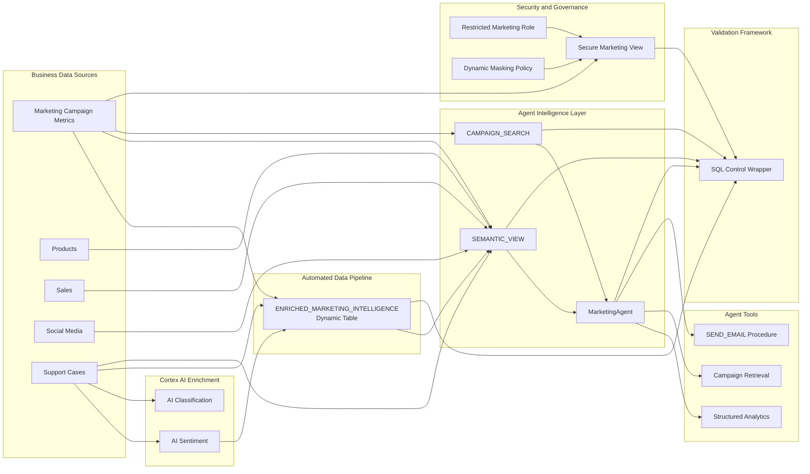

---

## End-to-End Data Flow

```text
Marketing, product, sales, social-media and support data
                         ↓
        Cortex AI sentiment and issue classification
                         ↓
     ENRICHED_MARKETING_INTELLIGENCE Dynamic Table
                         ↓
           Semantic View and Cortex Search
                         ↓
       Marketing and Sales Intelligence Agent
                         ↓
     Analytics, retrieval, charts and email delivery
                         ↓
       RBAC, secure view and Dynamic Data Masking
                         ↓
             Automated SQL validation
```

---

# Implementation

## 1. Snowflake Environment Provisioning

The setup script creates the Snowflake environment required by the project.

### Core environment

```text
Role:      SNOWFLAKE_INTELLIGENCE_ADMIN
Warehouse: DASH_WH_SI
Database:  DASH_DB_SI
Schema:    RETAIL
```

### Source tables

```text
MARKETING_CAMPAIGN_METRICS
PRODUCTS
SALES
SOCIAL_MEDIA
SUPPORT_CASES
```

### Supporting resources

The setup also provisions supporting Snowflake objects such as:

- Internal stages
- Access roles and grants
- Validation utilities
- Notification integration
- `SEND_EMAIL()` stored procedure
- Warehouse and schema resources

### Setup file

```text
snowflake-end-to-end-ai-agent-pipeline/sql/00_setup/00_setup.sql
```

### Setup evidence

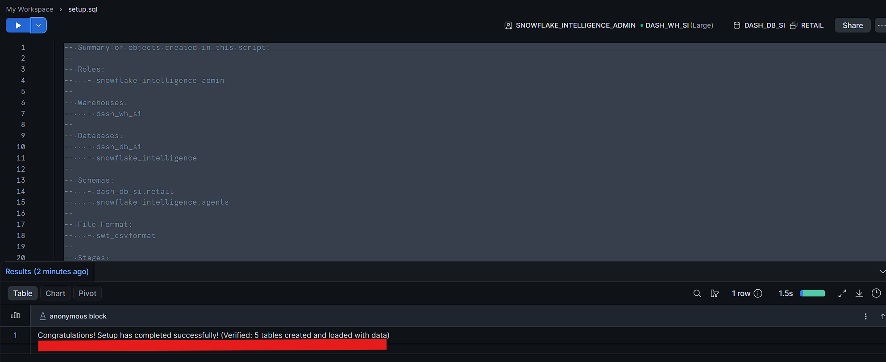

---

## 2. Cortex AI Enrichment

Customer-support transcripts begin as unstructured text.

The enrichment stage converts them into measurable analytical features using Snowflake Cortex AI.

### Sentiment analysis

```sql
SNOWFLAKE.CORTEX.AI_SENTIMENT(transcript)
```

This produces a sentiment score representing the emotional direction of a support interaction.

### Issue classification

```sql
SNOWFLAKE.CORTEX.AI_CLASSIFY(
    transcript,
    ['Return', 'Quality', 'Shipping']
)
```

This assigns each transcript to a defined business category.

### Why pre-enrich the text?

Persisting AI-generated features improves the design in several ways:

- The same transcript does not need to be reprocessed for every question.
- Sentiment becomes available as a reusable analytical measure.
- Issue classifications can be queried using normal SQL.
- Transformation logic remains visible and testable.
- Downstream models receive a more consistent data contract.
- Agent responses can be grounded in prepared features rather than repeated interpretation.

### Enrichment file

```text
snowflake-end-to-end-ai-agent-pipeline/sql/01_enrichment/01_cortex_ai_enrichment.sql
```

### Enrichment evidence

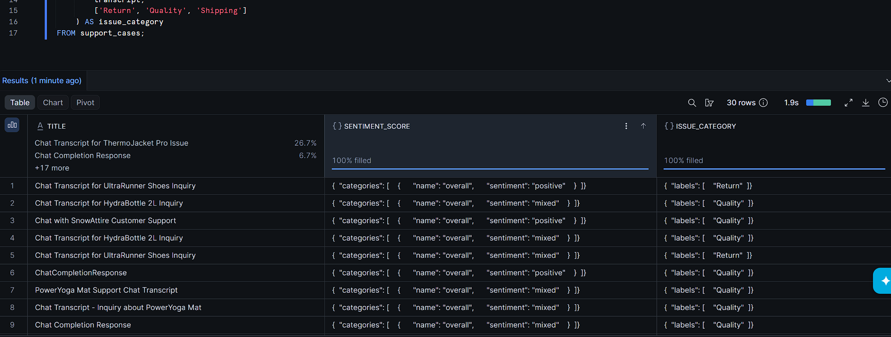

---

## 3. Marketing Data Ingestion

Updated campaign data is loaded into:

```text
DASH_DB_SI.RETAIL.MARKETING_CAMPAIGN_METRICS
```

The source CSV is retained in the repository for reproducibility:

```text
snowflake-end-to-end-ai-agent-pipeline/data/marketing_data.csv
```

### Load evidence

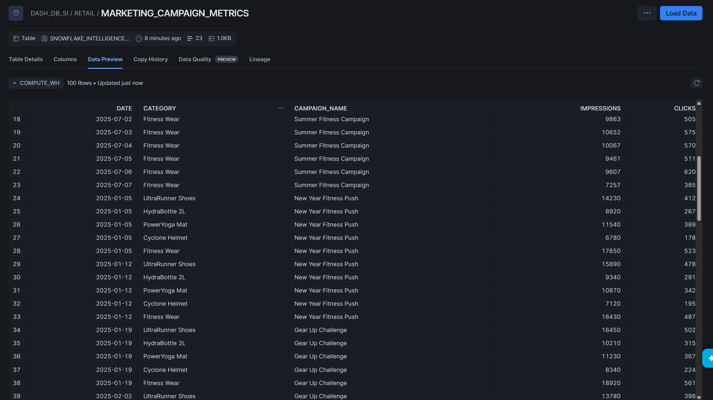

---

## 4. Live AI Enrichment Pipeline

The project creates the following Dynamic Table:

```text
DASH_DB_SI.RETAIL.ENRICHED_MARKETING_INTELLIGENCE
```

The table joins campaign engagement with product-level customer feedback and maintains AI-generated sentiment as the underlying data changes.

### Dynamic Table implementation

```sql
CREATE OR REPLACE DYNAMIC TABLE enriched_marketing_intelligence
TARGET_LAG = '1 hours'
WAREHOUSE = dash_wh_si
AS
SELECT
    m.campaign_name,
    m.clicks,
    s.product AS product_name,
    SNOWFLAKE.CORTEX.SENTIMENT(s.transcript) AS avg_sentiment
FROM marketing_campaign_metrics m
JOIN support_cases s
    ON m.category = s.product;
```

### Why use a Dynamic Table?

A Dynamic Table defines the desired output declaratively while Snowflake manages refresh behaviour.

This creates a maintained connection between:

```text
Campaign performance
        +
Customer-support feedback
        +
AI-generated sentiment
```

It avoids treating enrichment as a one-time analysis and instead turns it into a reusable pipeline object.

### Pipeline file

```text
snowflake-end-to-end-ai-agent-pipeline/sql/02_pipeline/02_live_enrichment_pipeline.sql
```

### Dynamic Table evidence

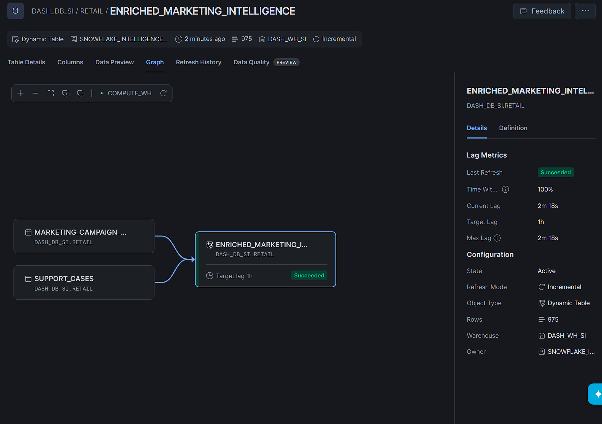

---

## 5. Semantic View

The Semantic View creates a business-friendly analytical model over the project data.

### Configuration

```text
Name:      SEMANTIC_VIEW
Location:  DASH_DB_SI.RETAIL
Warehouse: DASH_WH_SI
```

### Included data objects

- Marketing campaign metrics
- Products
- Sales
- Social-media activity
- Support cases
- Enriched marketing and sentiment data

### Modelled relationship

```text
ENRICHED_MARKETING_INTELLIGENCE.PRODUCT_NAME
                         ↓
MARKETING_CAMPAIGN_METRICS.CATEGORY
```

Relationship type:

```text
Many to One
```

### Why the Semantic View matters

The Agent needs more than access to raw tables.

The Semantic View gives the physical data model business meaning by defining relationships, measures and dimensions that can be used for natural-language analytics.

### Configuration file

```text
snowflake-end-to-end-ai-agent-pipeline/agent/01_semantic_view_configuration.md
```

### Semantic modelling evidence

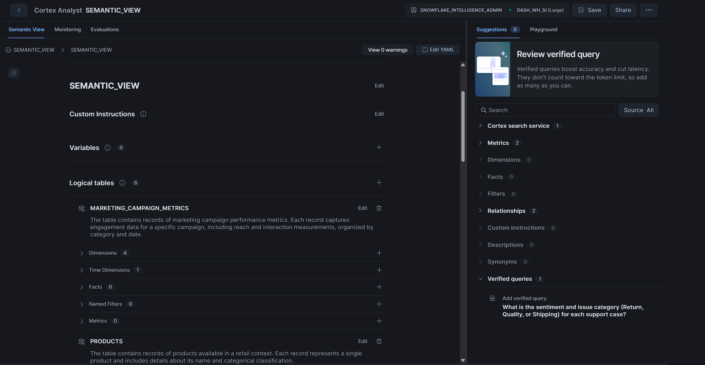

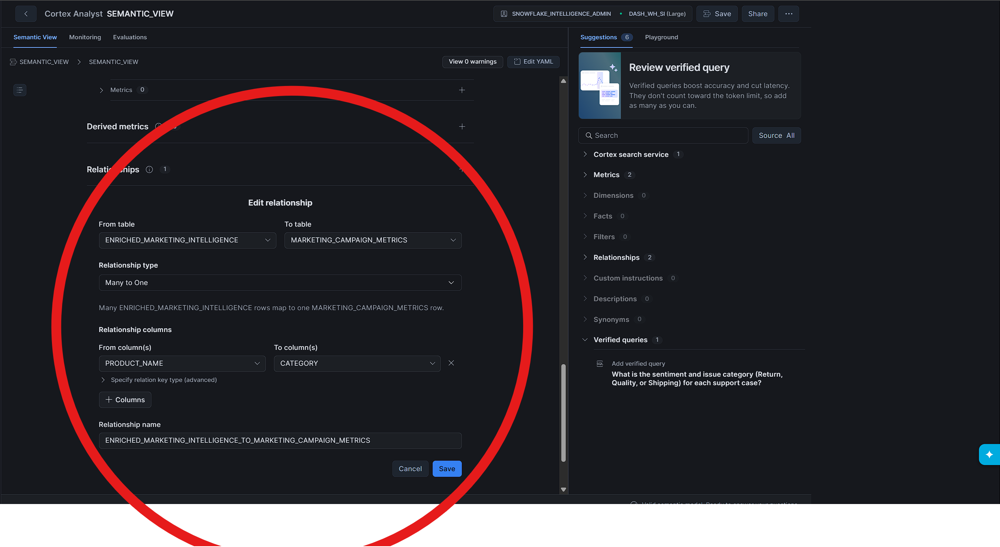

---

## 6. Cortex Search

The project creates a Cortex Search service named:

```text
DASH_DB_SI.RETAIL.CAMPAIGN_SEARCH
```

### Search configuration

```text
Source table:  MARKETING_CAMPAIGN_METRICS
Search column: CAMPAIGN_NAME
Attributes:    All
Columns:       All
Warehouse:     DASH_WH_SI
```

### Purpose

Cortex Search gives the Agent a retrieval layer over campaign information.

This complements the Semantic View:

| Component | Responsibility |
|---|---|
| Semantic View | Metrics, dimensions, relationships and structured analysis |
| Cortex Search | Retrieval-oriented access to indexed campaign information |
| MarketingAgent | Selects and coordinates the appropriate tool |

### Configuration file

```text
snowflake-end-to-end-ai-agent-pipeline/agent/02_cortex_search_configuration.md
```

### Search evidence

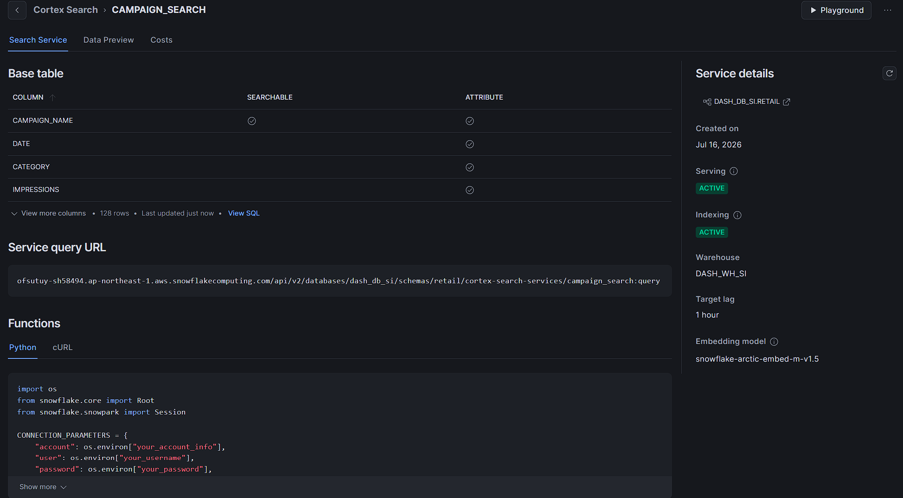

---

## 7. Marketing and Sales Intelligence Agent

The central AI application is:

```text
DASH_DB_SI.RETAIL.MarketingAgent
```

The Agent connects two forms of intelligence:

```text
What happened?
→ Campaign, sales and engagement metrics

Why did it happen?
→ Customer sentiment and support feedback
```

### Agent capabilities

The Agent can:

- Rank campaigns by engagement
- Analyse campaign-to-product relationships
- Compare clicks with customer sentiment
- Summarise support complaints
- Retrieve campaign information
- Generate charts
- Deliver findings through email
- Operate over a governed Snowflake data layer

### Agent tools

| Tool | Purpose |
|---|---|
| `semantic_view` | Structured analysis across campaigns, products, sales, social media, support and sentiment |
| `Search` | Retrieval through the `CAMPAIGN_SEARCH` Cortex Search service |
| `Send_Email` | Distribution of Agent findings through `SEND_EMAIL()` |

### Agent configuration

```text
snowflake-end-to-end-ai-agent-pipeline/agent/03_marketing_agent_configuration.md
```

### Agent validation prompts

```text
snowflake-end-to-end-ai-agent-pipeline/agent/04_agent_validation_prompts.md
```

### Agent configuration evidence

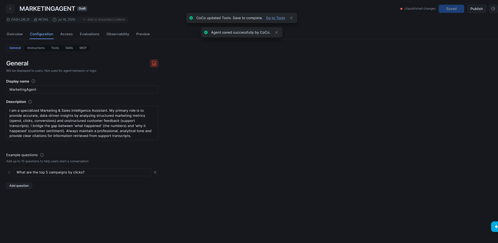

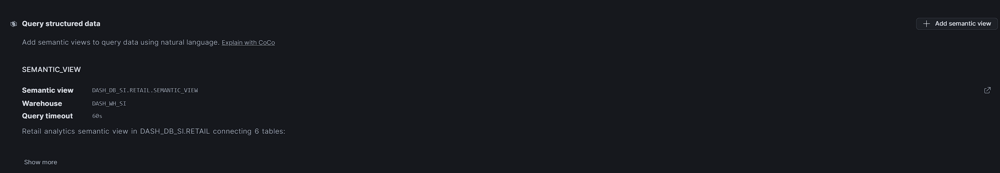

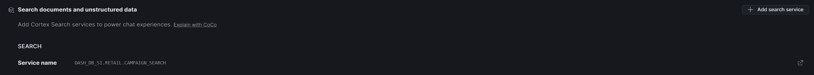

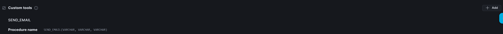

---

# Agent Validation

The Agent was tested using realistic business questions rather than only technical object checks.

## Test 1 — Campaign ranking

```text
What are the top 5 campaigns by clicks?
```

This tests:

- Metric selection
- Campaign ranking
- Structured analytical reasoning
- Visual presentation

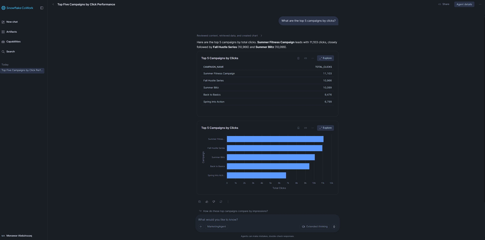

---

## Test 2 — Campaign and product relationships

```text
Show me all campaign performance metrics and its relationship to the product.
```

This tests:

- Semantic relationships
- Multi-object analysis
- Metric retrieval
- Product-level context

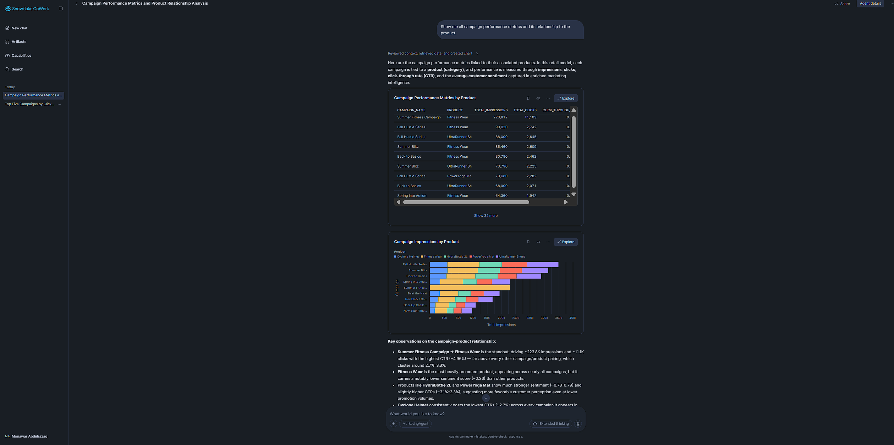

---

## Test 3 — Engagement and customer satisfaction

```text
What is the relationship between campaign clicks and customer satisfaction by category?
```

This tests the integration of:

- Campaign clicks
- Product categories
- AI-generated sentiment
- Cross-domain analysis

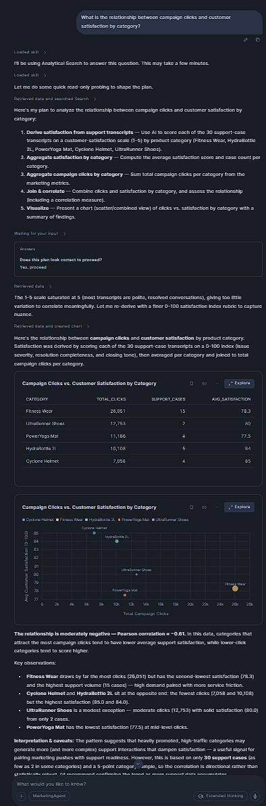

---

## Test 4 — Customer complaint analysis

```text
What are the main customer complaints in support cases?
```

This tests:

- Unstructured-text understanding
- Customer-support analysis
- Issue identification
- Retrieval and summarisation

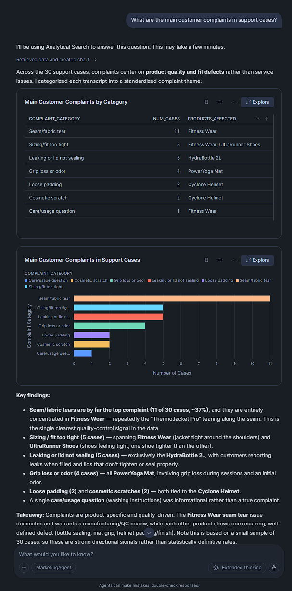

---

# Security and Governance

## 8. Role-Based Access Control

The governance implementation creates a restricted role:

```text
MARKETING_INTELLIGENCE_ROLE
```

The role receives only the access required to:

- Use the project warehouse
- Access the project database
- Access the `RETAIL` schema
- Query the governed marketing view
- Use the required Snowflake Cortex database role

This separates administrative access from business-user access.

---

## 9. Secure Marketing View

The project creates:

```text
DASH_DB_SI.RETAIL.MARKETING_INTELLIGENCE_VIEW
```

The secure view exposes selected campaign fields through a governed interface instead of requiring restricted users to query the base table directly.

### Benefits

- Controlled data exposure
- Consistent field naming
- Reduced direct base-table access
- Policy enforcement
- Safer downstream consumption
- Clear separation between raw storage and governed access

---

## 10. Dynamic Data Masking

A masking policy named:

```text
MASK_ENGAGEMENT_CLICKS
```

is applied to:

```text
DASH_DB_SI.RETAIL.MARKETING_CAMPAIGN_METRICS.CLICKS
```

### Role-aware behaviour

```text
SNOWFLAKE_INTELLIGENCE_ADMIN
→ Sees the real engagement values

ACCOUNTADMIN
→ Sees the real engagement values

MARKETING_INTELLIGENCE_ROLE
→ Sees 0 instead of the protected engagement values
```

The same query therefore returns different results based on the active role.

This demonstrates that governance remains enforced at the data layer rather than depending only on the behaviour of the Agent interface.

### Security implementation

```text
snowflake-end-to-end-ai-agent-pipeline/sql/03_security/03_rbac_and_masking.sql
```

### Administrator result

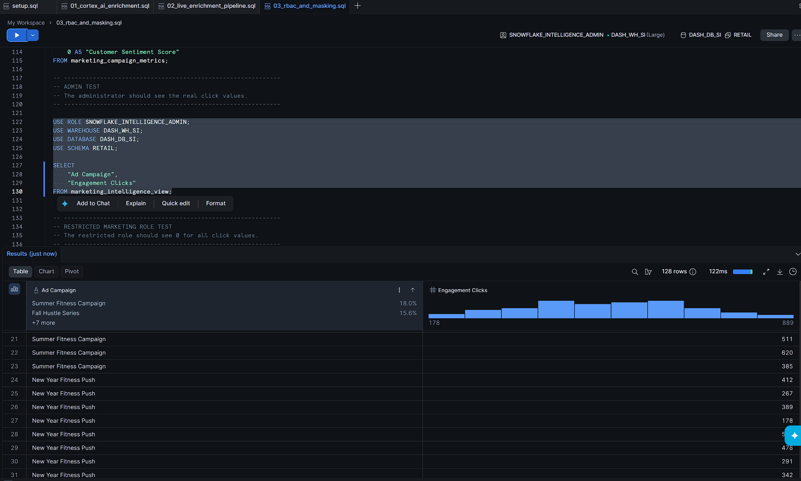

### Restricted-role result

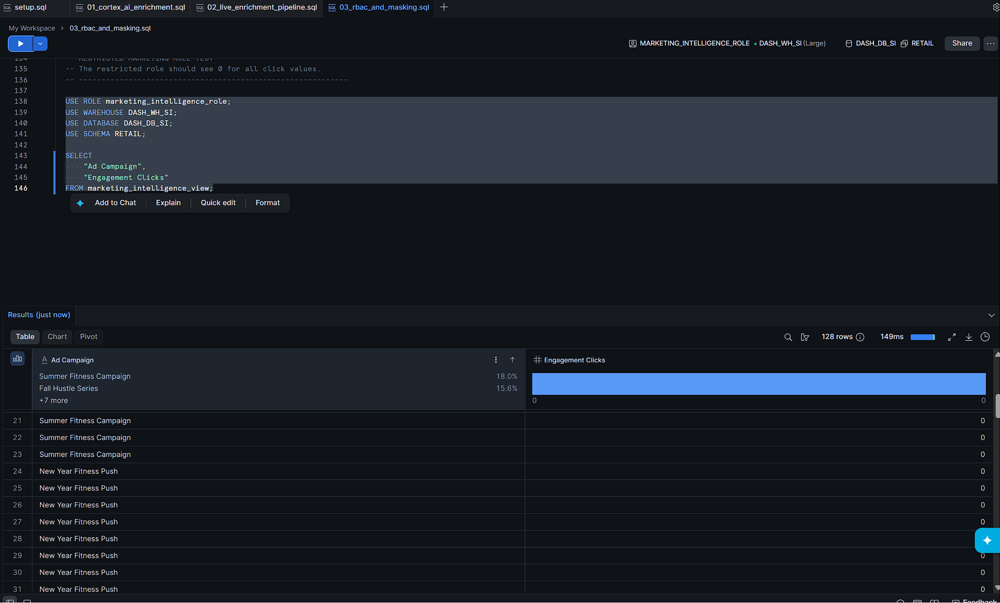

---

# Automated System Validation

## Validation Strategy

The final SQL validation wrapper verifies the required infrastructure, pipeline and AI objects.

The controls include:

- Required Snowflake databases
- Required stages
- Required source tables
- Enriched Dynamic Table
- Semantic View
- Cortex Search service
- Agent-related architecture
- End-to-end lab completion

### Validation file

```text
snowflake-end-to-end-ai-agent-pipeline/sql/04_validation/04_ai_agent_validation.sql
```

## Verified Result

```text
You've successfully completed the From Zero to Agents lab!
```

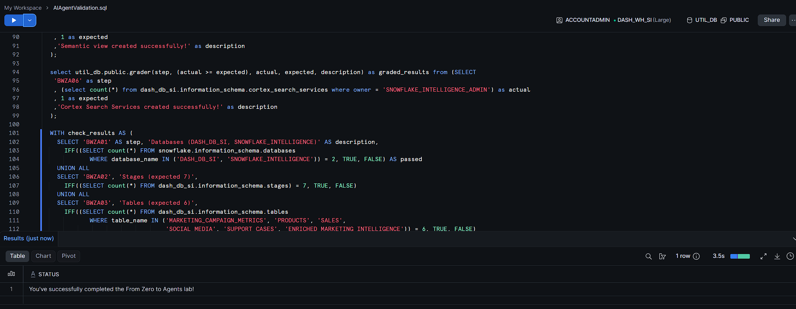

> [!TIP]
> The validation wrapper provides repeatable evidence that the required architecture exists. It is stronger than relying only on screenshots of individual objects.

---

# Repository Structure

```text
snowflake-end-to-end-ai-agent-pipeline/
│
├── README.md
│
├── sql/
│   ├── 00_setup/
│   │   └── 00_setup.sql
│   │
│   ├── 01_enrichment/
│   │   └── 01_cortex_ai_enrichment.sql
│   │
│   ├── 02_pipeline/
│   │   └── 02_live_enrichment_pipeline.sql
│   │
│   ├── 03_security/
│   │   └── 03_rbac_and_masking.sql
│   │
│   └── 04_validation/
│       └── 04_ai_agent_validation.sql
│
├── data/
│   └── marketing_data.csv
│
├── agent/
│   ├── 01_semantic_view_configuration.md
│   ├── 02_cortex_search_configuration.md
│   ├── 03_marketing_agent_configuration.md
│   └── 04_agent_validation_prompts.md
│
└── docs/
    └── screenshots/
        ├── 01-setup-success.png
        ├── 02-cortex-ai-enrichment.png
        ├── 03-marketing-data-loaded.png
        ├── 04-live-dynamic-table.png
        ├── 05-semantic-view.png
        ├── 06-semantic-relationship.png
        ├── 07-cortex-search-active.png
        ├── 08-agent-created.png
        ├── 09-analyst-tool.png
        ├── 10-search-tool.png
        ├── 11-email-tool.png
        ├── 12-top-campaigns.png
        ├── 13-campaign-product-metrics.png
        ├── 14-clicks-vs-satisfaction.png
        ├── 15-customer-complaints.png
        ├── 16-admin-unmasked-data.png
        ├── 17-marketing-role-masked-data.png
        └── 18-final-validation-success.png
```

---

# Execution Order

## Environment setup

```text
1. snowflake-end-to-end-ai-agent-pipeline/sql/00_setup/00_setup.sql
```

## AI enrichment

```text
2. snowflake-end-to-end-ai-agent-pipeline/sql/01_enrichment/01_cortex_ai_enrichment.sql
```

## Live enrichment pipeline

```text
3. Load snowflake-end-to-end-ai-agent-pipeline/data/marketing_data.csv
4. Run snowflake-end-to-end-ai-agent-pipeline/sql/02_pipeline/02_live_enrichment_pipeline.sql
```

## Intelligence layer

```text
5. Configure SEMANTIC_VIEW
6. Create CAMPAIGN_SEARCH
7. Create MarketingAgent
8. Add the semantic, search and email tools
9. Run the prompts in:
   snowflake-end-to-end-ai-agent-pipeline/agent/04_agent_validation_prompts.md
```

## Governance

```text
10. Run:
    snowflake-end-to-end-ai-agent-pipeline/sql/03_security/03_rbac_and_masking.sql
```

## Final validation

```text
11. Run:
    snowflake-end-to-end-ai-agent-pipeline/sql/04_validation/04_ai_agent_validation.sql
```

---

# Engineering Decisions

## Why enrich unstructured data before Agent execution?

Persisting sentiment and classification results creates reusable analytical features and avoids repeatedly processing identical transcripts.

## Why use a Dynamic Table?

The Dynamic Table maintains the AI-enriched dataset as its source data changes, turning enrichment into a repeatable pipeline rather than a one-time query.

## Why use both a Semantic View and Cortex Search?

The components solve different problems:

- The Semantic View supports measures, dimensions and relationships.
- Cortex Search supports indexed retrieval.
- The Agent coordinates both tools through a single conversational interface.

## Why add an email tool?

The stored procedure turns analysis into an operational workflow. A user can move from asking a question to distributing the answer without leaving the Agent experience.

## Why implement governance at the data layer?

An AI application should not bypass normal access controls.

RBAC, secure views and Dynamic Data Masking ensure protected values remain governed regardless of whether they are accessed through:

- Direct SQL
- A secure view
- A Semantic View
- An AI Agent
- Another downstream application

---

# Technical Stack

| Technology | Application |
|---|---|
| Snowflake | Data platform and governance environment |
| Snowflake Cortex AI | Sentiment analysis and text classification |
| Dynamic Tables | Maintained AI-enrichment pipeline |
| Semantic Views | Business-friendly analytical modelling |
| Cortex Search | Retrieval layer |
| Snowflake Agents | Tool orchestration and conversational analytics |
| Snowflake CoWork | Agent interaction and validation |
| SQL | Provisioning, transformation, security and validation |
| Dynamic Data Masking | Role-aware data protection |
| RBAC | Access-control architecture |
| Secure Views | Governed data exposure |
| Stored Procedures | Email-delivery capability |
| CSV | Marketing-data input |
| Markdown | Configuration and validation documentation |
| GitHub | Source control and technical portfolio |

---

# Skills Demonstrated

```text
Snowflake data engineering
Cortex AI
AI agent development
Structured and unstructured data integration
SQL transformation
Dynamic Tables
Semantic modelling
Cortex Search
Retrieval-augmented workflows
Agent tool orchestration
Sentiment analysis
Text classification
Data governance
Role-Based Access Control
Dynamic Data Masking
Secure views
Stored procedures
Automated validation
Technical documentation
```

---

# What This Project Demonstrates

This repository provides evidence that I can:

- Build a complete data-to-agent workflow
- Combine structured business data with unstructured customer feedback
- Create reusable AI-enriched data products
- Model business relationships for natural-language analytics
- Configure retrieval and analytical tools for an Agent
- Test an Agent using realistic business questions
- Turn Agent outputs into an operational email workflow
- Apply role-aware data protection
- Validate a multi-component architecture through repeatable SQL controls
- Organise code, configuration, evidence and documentation in GitHub

---

# Security

This repository does not contain:

```text
Passwords
Access tokens
Private keys
Snowflake connection files
config.toml
connections.toml
.env files
Authentication secrets
```

Private connection and authentication information remains outside the repository.

---

# Scope and Limitations

This implementation was completed in a controlled Snowflake learning environment using Snowflake-provided sample data and workshop resources.

It demonstrates production-aligned engineering patterns, but it is not presented as an independently deployed enterprise production system.

A production implementation would additionally require:

- Separate development, testing and production environments
- Infrastructure as code
- CI/CD deployment controls
- Automated regression testing
- Monitoring and alerting
- Cost and performance controls
- Centralised secrets management
- Formal data ownership
- Incident-management procedures
- Documented service-level objectives

---

# Acknowledgements

This project was completed through Snowflake’s **From Zero to Agents: Building End-to-End Data Pipelines for an AI Agent** workshop.

Snowflake provided the original scenario, sample data, environment setup and validation framework. This repository documents my completed implementation, AI-enrichment pipeline, Semantic View, Cortex Search service, Marketing Agent, custom tools, security controls and validation evidence.
